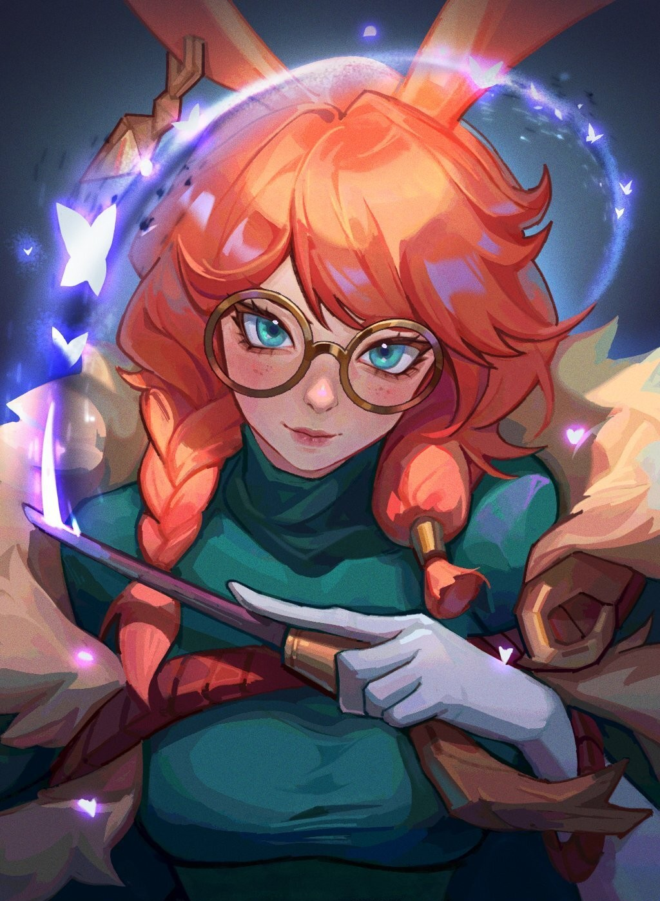
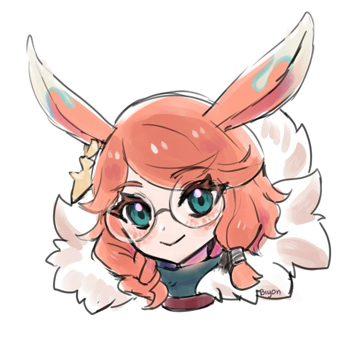
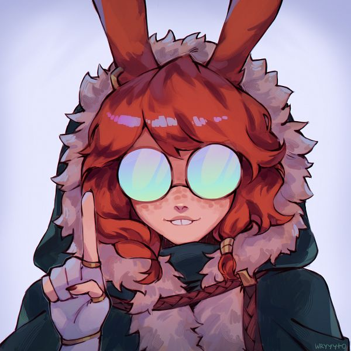
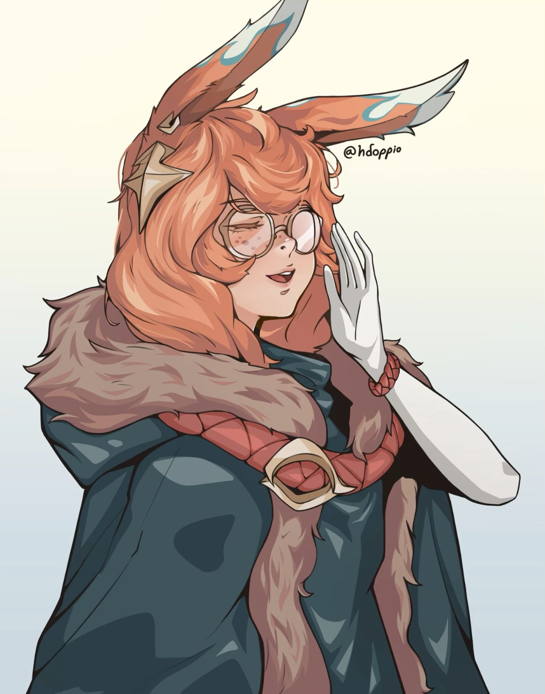
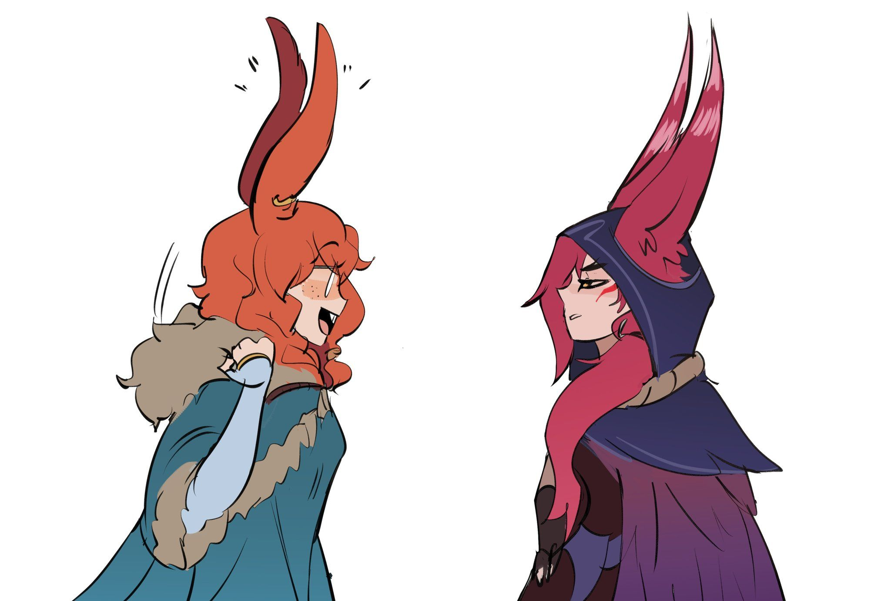
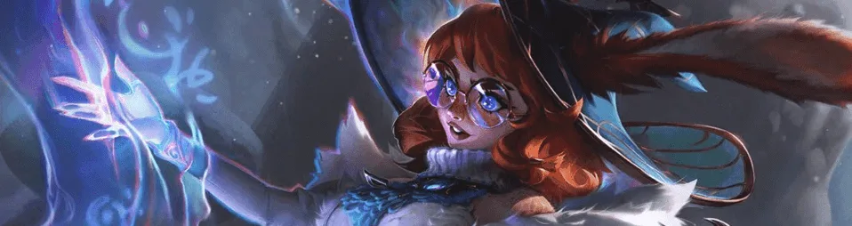

<!-- ═══════════════════════════════════════════════════════════════════════
     THEME: Aurora, the Witch Between Worlds  ·  Bryni vastaya of the Freljord
     CONCEPT: the README as a spirit researcher's field journal
     PALETTE (Aurora + League client UI):
       #0A1015  void          #10191D  surface
       #0AC8B9  spirit teal   #C8AA6E  gold
       #FF7A3D  ember orange  #F0E6D2  parchment cream
     BADGE SYSTEM: teal logos = craft  ·  gold logos = life outside the code
     ═══════════════════════════════════════════════════════════════════════ -->

 

## 📖 &nbsp;Field Notes

<table>
<tr>
<td width="55%" valign="top">

### Fullstack developer from Omsk

I build web products end to end — the API, the database behind it and the
interface on top. Working on both sides means fewer surprises in the middle.

When something breaks I look for the actual cause instead of patching around
it, and I write down the decisions I make so the next person doesn't have to
guess why the code looks the way it does.

Outside of work: games, guitar and a lot of cosplay events.

- 📍 &nbsp;**Based** — Omsk, Russia; remote for a Moscow IT company
- 🧭 &nbsp;**Doing** — web products end to end, Telegram platforms, infrastructure
- 🪄 &nbsp;**Field kit** — Python · Go · TypeScript · Kotlin
- 📓 &nbsp;**Habit** — documenting decisions and trade-offs
- 🐇 &nbsp;**In game** — Aurora main, hence the theme

</td>
<td width="45%" valign="top" align="center">

<i>❝ I see the Spirit Realm and material realm simultaneously — 
this blended world is my own... and it's beautiful. ❞</i>

</td>
</tr>
</table>

## 🪄 &nbsp;Starting Supplies

> ❝ I have my book, my wand, my starting supplies... Do I need anything else? Okay... Let's go! ❞

<table>
<tr>
<td valign="top" width="150"><b>Languages</b></td>
<td>

</td>
</tr>
<tr>
<td valign="top"><b>Backend</b></td>
<td>

</td>
</tr>
<tr>
<td valign="top"><b>Data Layer</b></td>
<td>

</td>
</tr>
<tr>
<td valign="top"><b>Storage &amp; Queues</b></td>
<td>

</td>
</tr>
<tr>
<td valign="top"><b>Async &amp; Jobs</b></td>
<td>

</td>
</tr>
<tr>
<td valign="top"><b>Telegram</b></td>
<td>

</td>
</tr>
<tr>
<td valign="top"><b>Frontend</b></td>
<td>

</td>
</tr>
<tr>
<td valign="top"><b>Mobile</b></td>
<td>

</td>
</tr>
<tr>
<td valign="top"><b>Infrastructure</b></td>
<td>

</td>
</tr>
<tr>
<td valign="top"><b>Observability</b></td>
<td>

</td>
</tr>
<tr>
<td valign="top"><b>Craft</b></td>
<td>

</td>
</tr>
</table>

## 🔬 &nbsp;Current Research

> ❝ Just so you all know, I'll be focused on my research. You can expect to receive my notes once I'm done. ❞

<table>
<tr>
<td width="33%" valign="top">

**🧭 &nbsp;Between Worlds**

Commercial web products — APIs, admin panels and the
interfaces on top of them.

</td>
<td width="33%" valign="top">

**🌀 &nbsp;The Weirding**

Telegram platforms: bots, Mini Apps and the services behind them.

</td>
<td width="33%" valign="top">

**❄️ &nbsp;Hearth-Home**

Infrastructure — Docker Compose stacks, reverse proxies,
metrics and logs.

</td>
</tr>
</table>

## 🎪 &nbsp;NEDO fest — One Festival, Five Services

> ❝ This region is teeming with wayward spirits. I'll find and help them all. ❞

<table>
<tr>
<td width="72%" valign="top">

My girlfriend and I organised **NEDO fest**, an anime and cosplay festival.
I built all the software for it — five services that had to work together
on the day of the event.

| Service | Stack | What it does |
|---|---|---|
| **Public site** | React · Vite · Tailwind | lineup, programme, ticket sales |
| **Admin dashboard** | React · TanStack Query · dnd-kit | participants, drag-and-drop schedule |
| **Jury app** | Kotlin · Android | scoring from the judges' table |
| **Scanner app** | Kotlin · Android | QR ticket check-in at the door |
| **Backend** | FastAPI · PostgreSQL · RabbitMQ | API, Telegram bot, QR generation, e-mail |

Everything runs in Docker behind Nginx. A Telegram bot handles communication
with participants, and slow tasks go through RabbitMQ so the API stays
responsive while people are queueing at the entrance.

</td>
<td width="28%" valign="top" align="center">

<i>❝ Do any of you wanna talk about spirits? ...I'll assume that's a yes! ❞</i>

</td>
</tr>
</table>

## 🏆 &nbsp;Field Expeditions

<table>
<tr>
<td width="28%" valign="top" align="center">

<i>❝ Oh! I've read about this! ❞</i>

</td>
<td width="72%" valign="top">

Omsk has an active tech scene and I take part in it regularly.

- 🧪 &nbsp;**Hackathons** — a lot of them, mostly local. Good practice for
  scoping a task and actually finishing it in two days.
- 🔭 &nbsp;**IT laboratories** — longer programmes with real tasks and mentors.
- 🎤 &nbsp;**Speaker** — gave a talk at one event about what I'd learned.

> ❝ Spending time with others is exhausting. If I seem curt, don't take it
> personally. ❞

</td>
</tr>
</table>

## 🌙 &nbsp;Beyond the Veil

<table>
<tr>
<td width="60%" valign="top">

**🎮 &nbsp;Games** — what I actually play:

**🎸 &nbsp;Guitar** — I play, and from time to time I work out a
**fingerstyle cover** of something I like.

**🎭 &nbsp;Cosplay** — I'm part of the local cosplay community. I've made a
couple of costumes myself and performed on stage in them.

</td>
<td width="40%" valign="top" align="center">

<i>❝ I like when it's quiet — I can hear myself think. ❞</i>

</td>
</tr>
</table>

## 💞 &nbsp;Duo Queue

<table>
<tr>
<td width="50%" valign="top" align="center">

<i>❝ Same hat? Same hat. ❞</i>

</td>
<td width="50%" valign="top">

A lot of what's above I do together with my girlfriend:

- 🎪 &nbsp;**NEDO fest** — we organised the festival together
- 🎭 &nbsp;**Cosplay** — costumes and performances on stage
- 🎮 &nbsp;**League** — we duo queue; she has her champion, I have mine

</td>
</tr>
</table>

## 👻 &nbsp;Wayward Spirits

> ❝ You know, technically, we're never more than five steps from a spirit. ❞

<picture>
  <source media="(prefers-color-scheme: dark)" srcset="https://raw.githubusercontent.com/Daniil-Danone/Daniil-Danone/output/snake-dark.svg" />
  <source media="(prefers-color-scheme: light)" srcset="https://raw.githubusercontent.com/Daniil-Danone/Daniil-Danone/output/snake.svg" />
  
</picture>

## 🎩 &nbsp;Same Hat?

 

 

<i>Open to new opportunities and interesting projects — 
web products, Telegram platforms and infrastructure.</i>

